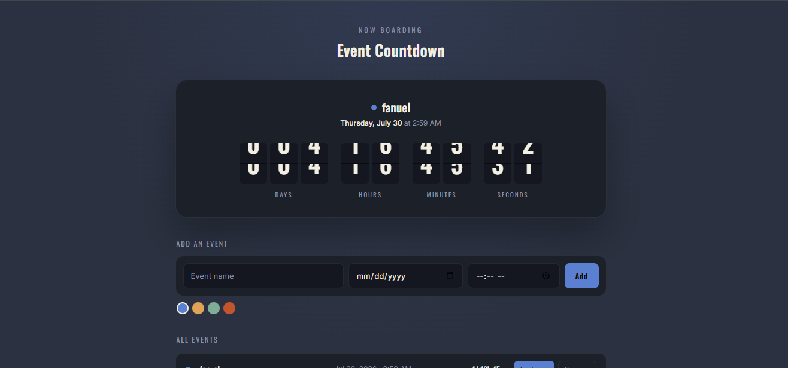

# ✈️ Event Countdown — Airport Terminal Split-Flap Timer

[](https://github.com/)
[](https://opensource.org/licenses/MIT)
[](https://github.com/)

> **"NOW BOARDING: Your next major milestone."**

**Event Countdown** is an aesthetic, client-side event tracking dashboard inspired by classic mechanical split-flap airport flight boards. Featuring an active flip-card timer display, multi-event scheduling, color-coded tag swatches, and persistent browser storage, it transforms standard target dates into an engaging, tactile countdown experience.

[Explore Live Terminal](https://yourusername.github.io/event-countdown) • [Report a Bug](https://github.com/yourusername/event-countdown/issues) • [Request Feature](https://github.com/yourusername/event-countdown/issues)

---

## 📸 Interface Preview & Gallery

### Flight-Board Display & Event Creation Panel
<!-- Replace this placeholder URL with your real cropped screenshot once uploaded to GitHub -->


### 🎥 Mechanical Split-Flap Walkthrough
> **Watch the terminal in action:** Click the workspace preview below to see dynamic split-flap flip mechanics, color tag assignments, and event list switching executing in real time.

[](https://github.com/yourusername/event-countdown "Watch Walkthrough")

---

## ✨ Core Engineering & Feature Set

* **🎟️ Mechanical Split-Flap Animation Engine:** Custom digit cards that simulate physical airport departure board flip mechanics for Days, Hours, Minutes, and Seconds.
* **📅 Multi-Event Creation Pipeline:** Add custom target titles, exact calendar dates (`mm/dd/yyyy`), and specific time stamps (`--:-- --`) through a clean terminal input row.
* **🎨 Color-Coded Tag Swatches:** Assign custom visual category indicators (blue, gold, emerald, terracotta) to distinguish work sprints, personal trips, and deadlines.
* **🗂️ All Events Queue ("Flight Log"):** Easily switch between active tracked events and manage past schedules from the unified `ALL EVENTS` manager list.
* **💾 Local Storage State Persistence:** Saves configured countdowns and active selections directly into browser storage to maintain data across reboots.

---

## 🛠 Tech Stack Matrix

| Module | Technologies | Core Operational Mandate |
| :--- | :--- | :--- |
| **Structure** | HTML5 | Accessible form fields, split-flap digit blocks, and event list containers |
| **Styling** | CSS3 Grid / 3D Transforms | Custom 3D card perspective flips, dark terminal color palette, fluid layout rules |
| **Engine** | Vanilla JavaScript | High-precision time delta calculations (`Date.parse`), dynamic DOM flips, `localStorage` synchronization |

---

## 📦 Rapid Local Setup

### 1. Repository Clone
```bash
git clone [https://github.com/yourusername/event-countdown.git](https://github.com/yourusername/event-countdown.git)
cd event-countdown
